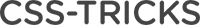
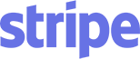
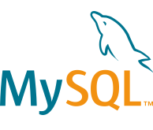

<section>

# Used By

Prism is used on several websites, small and large. Some of them are:

<div class="used-by-logos">
	<a href="https://www.smashingmagazine.com/" target="_blank"></a>
	<a href="https://alistapart.com/" target="_blank"></a>
	<a href="https://developer.mozilla.org/" target="_blank"></a>
	<a href="https://css-tricks.com/" target="_blank"></a>
	<a href="https://www.sitepoint.com/" target="_blank"></a>
	<a href="https://www.drupal.org/" target="_blank"></a>
	<a href="https://reactjs.org/" target="_blank"></a>
	<a href="https://stripe.com/" target="_blank"></a>
	<a href="https://dev.mysql.com/" target="_blank"></a>
</div>

</section>

<section>

# Examples

The Prism source, highlighted with Prism (don’t you just love how meta this is?):
<pre data-src="https://dev.prismjs.com/prism.js"></pre>

This page’s CSS code, highlighted with Prism:

<pre data-src="assets/style.css"></pre>

This page’s HTML, highlighted with Prism:

<pre data-src="index.html"></pre>

This page’s logo (SVG), highlighted with Prism:

<pre data-src="assets/logo.svg"></pre>

If you’re still not sold, you can [view more examples](examples.html) or [try it out for yourself](test.html).

</section>

<section class="language-markup">

# Full list of features

- **Only 2KB** minified & gzipped (core). Each language definition adds roughly 300-500 bytes.
- Encourages good author practices. Other highlighters encourage or even force you to use elements that are semantically wrong, like `<pre>` (on its own) or `<script>`. Prism forces you to use the correct element for marking up code: `<code>`. On its own for inline code, or inside a `<pre>` for blocks of code. In addition, the language is defined through the way recommended in the HTML5 draft: through a `language-xxxx` class.
- The `language-xxxx` class is inherited. This means that if multiple code snippets have the same language, you can just define it once,in one of their common ancestors.
- Supports **parallelism with Web Workers**, if available. Disabled by default ([why?](faq.html#why-is-asynchronous-highlighting-disabled-by-default)).
- Very easy to extend without modifying the code, due to Prism’s [plugin architecture](#plugins). Multiple hooks are scattered throughout the source.
- Very easy to [define new languages](extending.html#language-definitions). The only thing you need is a good understanding of regular expressions.
- All styling is done through CSS, with [sensible class names](faq.html#how-do-i-know-which-tokens-i-can-style-for) rather than ugly, namespaced, abbreviated nonsense.
- Wide browser support: Edge, IE11, Firefox, Chrome, Safari, [Opera](faq.html#this-page-doesnt-work-in-opera), most mobile browsers.
- Highlights embedded languages (e.g. CSS inside HTML, JavaScript inside HTML).
- Highlights inline code as well, not just code blocks.
- It doesn’t force you to use any Prism-specific markup, not even a Prism-specific class name, only standard markup you should be using anyway. So, you can just try it for a while, remove it if you don’t like it and leave no traces behind.
- Highlight specific lines and/or line ranges (requires [plugin](https://plugins.prismjs.com/line-highlight/)).
- Show invisible characters like tabs, line breaks etc (requires [plugin](https://plugins.prismjs.com/show-invisibles/)).
- Autolink URLs and emails, use Markdown links in comments (requires [plugin](https://plugins.prismjs.com/autolinker/)).

</section>

<section>

# Limitations

- Any pre-existing HTML in the code will be stripped off. [There are ways around it though](faq.html#if-pre-existing-html-is-stripped-off-how-can-i-highlight).
- Regex-based so it \*will\* fail on certain edge cases, which are documented in the [known failures page](known-failures.html).
- Some of our themes have problems with certain layouts. Known cases are documented [here](known-failures.html#themes).
- No IE 6-10 support. If someone can read code, they are probably in the 95% of the population with a modern browser.

</section>

<section class="language-markup">

# Basic usage

You will need to include the `prism.css` and `prism.js` files you [downloaded](download.html) in your page. Example:

```html
<!DOCTYPE html>
<html>
<head>
	...
	<link href="themes/prism.css" rel="stylesheet" />
</head>
<body>
	...
	<script src="prism.js"></script>
</body>
</html>
```

Prism does its best to encourage good authoring practices. Therefore, it only works with `<code>` elements, since marking up code without a `<code>` element is semantically invalid. [According to the HTML5 spec](https://www.w3.org/TR/html52/textlevel-semantics.html#the-code-element), the recommended way to define a code language is a `language-xxxx` class, which is what Prism uses. Alternatively, Prism also supports a shorter version: `lang-xxxx`.

The [recommended way to mark up a code block](https://www.w3.org/TR/html5/grouping-content.html#the-pre-element) (both for semantics and for Prism) is a `<pre>` element with a `<code>` element inside, like so:

```html
<pre><code class="language-css">p { color: red }</code></pre>
```

If you use that pattern, the `<pre>` will automatically get the `language-xxxx` class (if it doesn’t already have it) and will be styled as a code block.

Inline code snippets are done like this:

```html
<code class="language-css">p { color: red }</code>
```

**Note**: You have to escape all `<` and `&` characters inside `<code>` elements (code blocks and inline snippets) with `&lt;` and `&amp;` respectively, or else the browser might interpret them as an HTML tag or [entity](https://developer.mozilla.org/en-US/docs/Glossary/Entity). If you have large portions of HTML code, you can use the [Unescaped Markup plugin](https://plugins.prismjs.com/unescaped-markup/) to work around this.

### Language inheritance

To make things easier however, Prism assumes that the language class is inherited. Therefore, if multiple `<code>` elements have the same language, you can add the `language-xxxx` class on one of their common ancestors. This way, you can also define a document-wide default language, by adding a `language-xxxx` class on the `<body>` or `<html>` element.

If you want to opt-out of highlighting a `<code>` element that inherits its language, you can add the `language-none` class to it. The `none` language can also be inherited to disable highlighting for the element with the class and all of its descendants.

If you want to opt-out of highlighting but still use plugins like [Show Invisibles](https://plugins.prismjs.com/show-invisibles/), add use `language-plain` class instead.

### Manual highlighting

If you want to prevent any elements from being automatically highlighted and instead use the [API](extending.html#api-documentation), you can set [`Prism.manual`{ .language-javascript }](docs/Prism.html#.manual) to `true`{ .language-javascript } before the `DOMContentLoaded` event is fired. By setting the `data-manual` attribute on the `<script>` element containing Prism core, this will be done automatically. Example:

```html
<script src="prism.js" data-manual></script>
```

or

```html
<script>
window.Prism = window.Prism || {};
window.Prism.manual = true;
</script>
<script src="prism.js"></script>
```

## Usage with CDNs { #basic-usage-cdn }

In combination with CDNs, we recommend using the [Autoloader plugin](https://plugins.prismjs.com/autoloader) which automatically loads languages when necessary.

The setup of the Autoloader, will look like the following. You can also add your own themes of course.

```html
<!DOCTYPE html>
<html>
<head>
	...
	<link href="https://{{cdn}}/prismjs@v1.x/themes/prism.css" rel="stylesheet" />
</head>
<body>
	...
	<script src="https://{{cdn}}/prismjs@v1.x/components/prism-core.min.js"></script>
	<script src="https://{{cdn}}/prismjs@v1.x/plugins/autoloader/prism-autoloader.min.js"></script>
</body>
</html>
```

Please note that links in the above code sample serve as placeholders. You have to replace them with valid links to the CDN of your choice.

CDNs which provide PrismJS are e.g. [cdnjs](https://cdnjs.com/libraries/prism), [jsDelivr](https://www.jsdelivr.com/package/npm/prismjs), and [UNPKG](https://unpkg.com/browse/prismjs@1/).

## Usage with Webpack, Browserify, & Other Bundlers { #basic-usage-bundlers }

If you want to use Prism with a bundler, install Prism with `npm`:

```bash
$ npm install prismjs
```

You can then `import` into your bundle:

```js
import Prism from 'prismjs';
```

To make it easy to configure your Prism instance with only the languages and plugins you need, use the babel plugin, [babel-plugin-prismjs](https://github.com/mAAdhaTTah/babel-plugin-prismjs). This will allow you to load the minimum number of languages and plugins to satisfy your needs. See that plugin's documentation for configuration details.

## Usage with Node { #basic-usage-node }

If you want to use Prism on the server or through the command line, Prism can be used with Node.js as well. This might be useful if you're trying to generate static HTML pages with highlighted code for environments that don't support browser-side JS, like [AMP pages](https://www.ampproject.org/).

Example:

```js
const Prism = require('prismjs');

// The code snippet you want to highlight, as a string
const code = `var data = 1;`;

// Returns a highlighted HTML string
const html = Prism.highlight(code, Prism.languages.javascript, 'javascript');
```

Requiring `prismjs` will load the default languages: `markup`, `css`, `clike` and `javascript`. You can load more languages with the `loadLanguages()`{ .language-javascript } utility, which will automatically handle any required dependencies.

Example:

```js
const Prism = require('prismjs');
const loadLanguages = require('prismjs/components/');
loadLanguages(['haml']);

// The code snippet you want to highlight, as a string
const code = `= ['hi', 'there', 'reader!'].join " "`;

// Returns a highlighted HTML string
const html = Prism.highlight(code, Prism.languages.haml, 'haml');
```

**Note**: Do _not_ use `loadLanguages()`{ .language-javascript } with Webpack or another bundler, as this will cause Webpack to include all languages and plugins. Use the babel plugin described above.

**Note**: `loadLanguages()`{ .language-javascript } will ignore unknown languages and log warning messages to the console. You can prevent the warnings by setting `loadLanguages.silent = true`{ .language-javascript }.

</section>

<section class="language-markup">

# Supported languages

This is the list of all {{ allLanguages | length }} languages currently supported by Prism, with their corresponding alias, to use in place of `xxxx` in the `language-xxxx` (or `lang-xxxx`) class:

<ul id="languages-list">
	
	<li data-id="{{ id }}">
		{{ language.title }}&nbsp;— 
		
			<code>{{ alias }}</code>{{ ", " if not loop.last }}
		
	</li>
	
</ul>

Couldn’t find the language you were looking for? [Request it](https://github.com/PrismJS/prism/issues)!

</section>

<section>

# Plugins

Plugins are additional scripts (and CSS code) that extend Prism’s functionality. Many of the following plugins are official, but are released as plugins to keep the Prism Core small for those who don’t need the extra functionality.

<ul class="plugin-list">
	
	<li>
		<a href="https://plugins.prismjs.com/{{ id }}">{{ plugin.title }}</a>
		<div>{{ plugin.description | safe }}</div>
	</li>
	
</ul>

No assembly required to use them. Just select them in the [download](download.html) page.

It’s very easy to [write your own Prism plugins](extending.html#writing-plugins). Did you write a plugin for Prism that you want added to this list? [Send a pull request](https://github.com/PrismJS/plugins/)!

</section>

<section>

# Third-party language definitions

- [SassDoc Sass/Scss comments](https://github.com/SassDoc/prism-scss-sassdoc)
- [Liquibase CLI Bash language extension](https://github.com/Liquibase/prism-liquibase)

</section>

<section>

# Third-party tutorials

Several tutorials have been written by members of the community to help you integrate Prism into multiple different website types and configurations:

- [How to Add Prism.js Syntax Highlighting to Your WordPress Site](https://startblogging101.com/how-to-add-prism-js-syntax-highlighting-wordpress/)
- [Escape HTML Inside `<code>` or `<pre>` Tag to Entities to Display Raw Code with PrismJS](https://websitebeaver.com/escape-html-inside-code-or-pre-tag-to-entities-to-display-raw-code-with-prismjs)
- [Adding a Syntax Highlighter Shortcode Using Prism.js | WPTuts+](http://wp.tutsplus.com/tutorials/plugins/adding-a-syntax-highlighter-shortcode-using-prism-js/)
- [Implement PrismJs Syntax Highlighting to your Blogger/BlogSpot](https://www.stramaxon.com/2012/07/prism-syntax-highlighter-for-blogger.html)
- [How To Re-Run Prism.js On AJAX Content](https://schier.co/blog/2013/01/07/how-to-re-run-prismjs-on-ajax-content.html)
- [Highlight your code syntax with Prism.js](https://www.semisedlak.com/highlight-your-code-syntax-with-prismjs)
- [A code snippet content element powered by Prism.js for TYPO3 CMS](https://usetypo3.com/fs-code-snippet.html)
- [Code syntax highlighting with Angular and Prism.js](https://auralinna.blog/post/2017/code-syntax-highlighting-with-angular-and-prismjs)
- [Code syntax highlighting in Gutenberg, WordPress block editor](https://mkaz.blog/wordpress/code-syntax-highlighting-in-gutenberg/)
- [Code Highlighting with Prism.js in Drupal](https://karlkaufmann.com/writing/technotes/code-highlighting-prism-drupal)
- [Code highlighting in React using Prism.js](https://betterstack.dev/blog/code-highlighting-in-react-using-prismjs/)
- [Using Prism.js in React Native](https://www.akashmittal.com/react-native-prismjs-using-webview/)
- [PrismJS Tutorial | Implement Prism in HTML and React](https://itsmycode.com/prismjs-tutorial/)
- Code syntax highlighting in Pug with [:highlight](https://webdiscus.github.io/pug-loader/pug-filters/highlight.html) and [:markdown](https://webdiscus.github.io/pug-loader/pug-filters/markdown.html) filters using [pug-loader](https://github.com/webdiscus/pug-loader) and Prism.js

Please note that the tutorials listed here are not verified to contain correct information. Read at your risk and always check the official documentation here if something doesn’t work 🙂

Have you written a tutorial about Prism that’s not already included here? Send a pull request!

</section>

<section>

# Credits

- Special thanks to [Michael Schmidt](https://github.com/RunDevelopment), [James DiGioia](https://github.com/mAAdhaTTah), [Golmote](https://github.com/Golmote) and [Jannik Zschiesche](https://github.com/apfelbox) for their contributions and for being **amazing maintainers**. Prism would not have been able to keep up without their help.
- To [Roman Komarov](https://twitter.com/kizmarh) for his contributions, feedback and testing.
- To [Zachary Forrest](https://twitter.com/zdfs) for [coming up with the name “Prism”](https://twitter.com/zdfs/statuses/217834980871639041)
- To [stellarr](https://stellarr.deviantart.com/) for the [spectrum background](https://stellarr.deviantart.com/art/Spectra-Wallpaper-Pack-97785901) used on this page
- To [Jason Hobbs](https://twitter.com/thecodezombie) for [encouraging me](https://twitter.com/thecodezombie/status/217663703825399809) to release this script as standalone`

</section>
