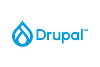
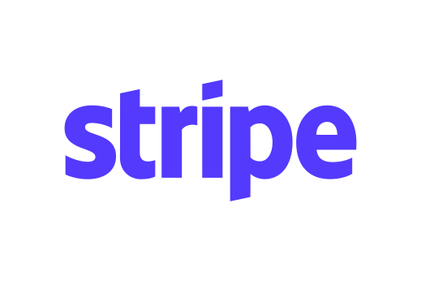
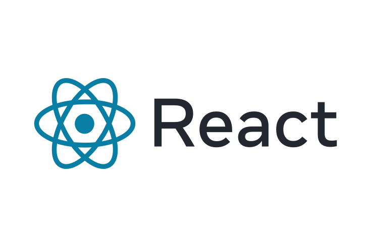
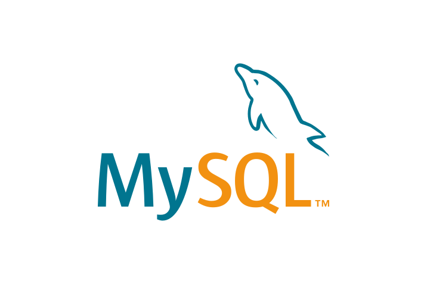

<section>

# Used By

Prism is used on several websites, small and large. Some of them are:

- [](https://www.smashingmagazine.com/){target=_blank}
- [](https://developer.mozilla.org/){target=_blank}
- [](https://www.drupal.org/){target=_blank}
- [](https://css-tricks.com/){target=_blank}
- [](https://stripe.com/){target=_blank}
- [](https://www.sitepoint.com/){target=_blank}
- [](https://reactjs.org/){target=_blank}
- [](https://alistapart.com/){target=_blank}
- [](https://dev.mysql.com/){target=_blank}
  {.used-by-logos}

</section>

<section>

# Three steps to highlighted code

<ol class="steps">
<li>

## Get Prism

[Download](/download/) `prism.js` and `prism.css` with just the languages and plugins you need, or [load them from a CDN](/start/#basic-usage-cdn).

</li>
<li>

## Include it in your page

```html
<link href="prism.css" rel="stylesheet" />
<script src="prism.js"></script>
```

</li>
<li>

## Mark up your code

```html
<pre><code class="language-css">p { color: red }</code></pre>
```

Prism finds it on load and highlights it. The class is [inherited](/start/#language-inheritance), so one on a common ancestor covers every snippet inside.

</li>
</ol>

That’s it. Read the [full walkthrough](/start/), see [what else Prism does](/features/), or [try it out for yourself](/test/).

</section>

<section>

# Credits

- Special thanks to [Michael Schmidt](https://github.com/RunDevelopment), [James DiGioia](https://github.com/mAAdhaTTah), [Golmote](https://github.com/Golmote) and [Jannik Zschiesche](https://github.com/apfelbox) for their contributions and for being **amazing maintainers**. Prism would not have been able to keep up without their help.
- To [Roman Komarov](https://twitter.com/kizmarh) for his contributions, feedback and testing.
- To [Zachary Forrest](https://twitter.com/zdfs) for [coming up with the name “Prism”](https://twitter.com/zdfs/statuses/217834980871639041).
- To [Jason Hobbs](https://twitter.com/thecodezombie) for [encouraging me](https://twitter.com/thecodezombie/status/217663703825399809) to release this script as standalone.

</section>
