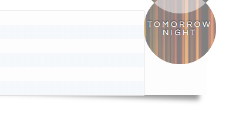

There are certain edge cases where Prism will fail. There are always such cases in every regex-based syntax highlighter.  
However, Prism dares to be open and honest about them. If a failure is listed here, it doesn’t mean it will never be fixed. This is more of a “known bugs” list, just with a certain type of bug.




<section class="language-{{ lang }}">
	<h1 id="{{ lang }}">
		<a href="#{{ lang }}">{{ allLanguages[lang].title }}</a>
	</h1>
	
	<h3>{{ issue.heading | md_inline | safe }}</h3>
	
	
{{ issue.description | md_inline | safe }}

	
	
	<pre><code>{{ example | safe | nl2br }}</code></pre>
	
	
	
<a href="#toc">↑ Back to top</a>

</section>


<section>

# Themes

Some of our themes are not compatible with certain layouts.

## Coy

Coy's shadows and background might not wrap around the code correctly if combined with float of flexbox layouts.

### Workarounds

There are 2 possible workarounds:

The first workaround is setting `display: flex-root;` for the `pre` element. This will fix the issue but `flex-root` has [limited browser support](https://caniuse.com/#feat=flow-root).

The second is adding `clear: both;` to the style of the `pre` element. This will fix the issue but it will change the way code blocks behave when overlapping with other elements.

[↑ Back to top](#toc)
</section>
